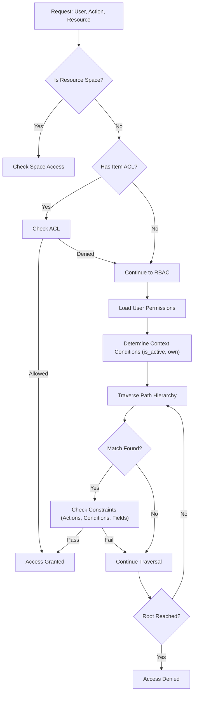

A deep technical overview of the DMART Access Control system. The system implements a hybrid model combining **Role-Based Access Control (RBAC)** for broad permissions and **Access Control Lists (ACLs)** for fine-grained, resource-specific overrides.

## Core Architecture

The access control logic is centralized in the `PermissionService` class. Data models are defined in `Dmart.Models.Core`.

### Key Components

**Permission** The atomic unit of access. Defines _what_ can be done on _which_ resources under _what_ conditions.

**Role** A named collection of Permission shortnames.

**Group** A named collection of Roles. Users are assigned to Groups.

**User** The actor. Can have direct Roles and inherit Roles from Groups.

**ACL** Optional list embedded in a Resource that grants specific users specific actions, bypassing standard RBAC.

## The Authorization Algorithm

The `CanAsync` method is the gatekeeper. It evaluates requests based on the following precedence order:



## Detailed Evaluation Steps

### 1. ACL Evaluation (Short-Circuit)

Before evaluating roles, the system checks if the specific resource instance has an **Access Control List (ACL)** defined.

- **Check:** Per-entry `acl` list match

- **Logic:** If `entry.acl` exists and contains an entry for `user_shortname` with the requested `action_type`, access is **immediately granted**.

- **Note:** ACLs are strictly _additive_. They cannot explicitly deny access if a Role allows it, but they are checked _before_ Roles, allowing for performance optimization on specific items.

### 2. Permission Aggregation

If no ACL grants access, the system compiles the user's effective permissions.

- **Source:** User's direct Roles + Roles from User's Groups.

- **Storage:** Permissions are stored in the SQL database for fast lookup.

### 3. Contextual Conditions

The system determines the "state" of the request to match against Permission conditions.

- **`is_active`:** Set if the resource's `is_active` flag is True.

- **`own`:** Set if `resource.owner_shortname == user.shortname` OR `resource.owner_group` is in `user.groups`.

### 4. Hierarchy Traversal & Global Wildcards

The system checks permissions starting from the specific resource path up to the root.

`/space/folder/subfolder/resource`

**Traversal Order:**

1. Specific Path: `space:/folder/subfolder/resource`

2. Parent: `space:/folder/subfolder`

3. ...

4. Root: `space:/`

**Wildcard Checks:**

- `__all_spaces__` — Grants access across all spaces.

- `__all_subpaths__` — Grants access to any subpath.

### 5. Constraint Validation

When a matching Permission key is found, three checks must pass:

1. **Action Check:** Is `action_type` (e.g., `view`, `create`) in `allowed_actions`?

2. **Condition Check:** Does the Permission require conditions (e.g., `own`)? If yes, does the current Context satisfy them?

**Field-Level Restrictions:**

- **Restricted Fields:** For `update`/`create`, ensures the user is not modifying fields listed in `restricted_fields`.

- **Allowed Values:** Checks if the values being assigned to fields match `allowed_fields_values`.

### 6. User Profile Protection

For User Profile updates, an additional layer of protection exists via the `user_profile_payload_protected_fields` setting. This global setting prevents users from modifying specific fields in their own profile payload, even if their Role technically allows "update" access.

## Permission JSON Structure

Permissions are defined as JSON objects. Understanding these keys is critical for configuring access.

| Key | Type | Description |
|---|---|---|
| `subpaths` | `Dictionary<string, List<string>>` | **Target Scope.** Maps Space names to subpaths. Use `__all_subpaths__` for recursive access, `__all_spaces__` for global access. |
| `resource_types` | `List<string>` | **Target Resources.** The types of objects this permission applies to — one or more resource types (see [Allowed Values](#allowed-values) below). An empty list applies to _all_ types. |
| `actions` | `List<string>` | **Allowed Operations.** What the user can do — one or more of the 11 action types (see [Allowed Values](#allowed-values) below). An empty list grants nothing. |
| `conditions` | `List<string>` | **Contextual Requirements.** `own` and/or `is_active` (see [Allowed Values](#allowed-values) below). An empty list = no conditions. |
| `restricted_fields` | `List<string>` | **Field Protection.** Fields that _cannot_ be modified in `create` or `update` requests. |
| `allowed_fields_values` | `Dictionary<string, object>` | **Value Constraints.** Enforces that specific fields can only take specific values. |

### Allowed Values

The `actions`, `conditions`, and `resource_types` arrays only accept the fixed sets below — any other string is rejected.

#### Actions — the 11 operation types

| Action | Authorizes |
|---|---|
| `view` | Read a single entry's metadata and payload. |
| `query` | Search / list entries via the `/query` endpoint. |
| `create` | Create a new entry. |
| `update` | Modify an existing entry's metadata or payload. |
| `delete` | Remove an entry. |
| `attach` | Add attachments (comments, media, reactions, relationships) to an entry. |
| `assign` | Change an entry's ownership (owner or owning group). |
| `move` | Move or rename an entry to a different subpath / shortname. |
| `progress_ticket` | Advance a ticket through its workflow states. |
| `lock` | Place a lock on an entry to block concurrent edits. |
| `unlock` | Release a lock on an entry. |

#### Conditions — the 2 contextual gates

| Condition | Requirement |
|---|---|
| `own` | The requesting user must own the entry — its `owner_shortname` equals the user, or the entry's owning group is one of the user's groups. |
| `is_active` | The entry's `is_active` flag must be `true`. |

Conditions gate access to _existing_ entries, so the `create` and `query` actions are exempt from condition checks.

#### Resource types — what the permission targets

Any of the platform's [resource types](/data-model) may be listed. An empty `resource_types` array applies to **all** types. The full set, grouped:

**Identity** `user`, `group`

**Structure** `folder`, `space`

**Content** `content`, `schema`, `data_asset`, `csv`, `jsonl`, `sqlite`, `parquet`

**Workflow** `ticket`

**Social** `comment`, `reply`, `post`, `reaction`, `notification`, `share`

**Attachments** `media`, `log`, `relationship`, `alteration`, `history`, `lock`

**Management** `role`, `permission`, `acl`

**Extensions** `locator`, `json`, `plugin_wrapper`

## Permission Examples

### Super Manager — Full Access

```json
{
  "shortname": "super_manager",
  "subpaths": {
    "__all_spaces__": ["__all_subpaths__"]
  },
  "resource_types": [
    "schema", "space", "content", "user", "..."
  ],
  "actions": [
    "delete", "update", "query", "create", "view", "attach"
  ],
  "conditions": [],
  "restricted_fields": []
}
```

Grants **unrestricted access** to all resources in all spaces. No ownership requirement, no field restrictions.

### View Users — Read-Only Scope

```json
{
  "shortname": "view_users",
  "subpaths": {
    "management": ["users"]
  },
  "resource_types": [
    "content", "ticket", "folder"
  ],
  "actions": ["view", "query"],
  "conditions": []
}
```

Read-only access to the `users` subpath within the `management` space only.

### Edit Own Profile — Restricted Update

```json
{
  "shortname": "edit_own_profile",
  "resource_types": ["user"],
  "actions": ["update"],
  "conditions": ["own"],
  "restricted_fields": ["roles", "is_active"],
  "allowed_fields_values": {}
}
```

Can only edit **their own** user record. Cannot modify `roles` or `is_active` fields — prevents self-promotion or account manipulation.
