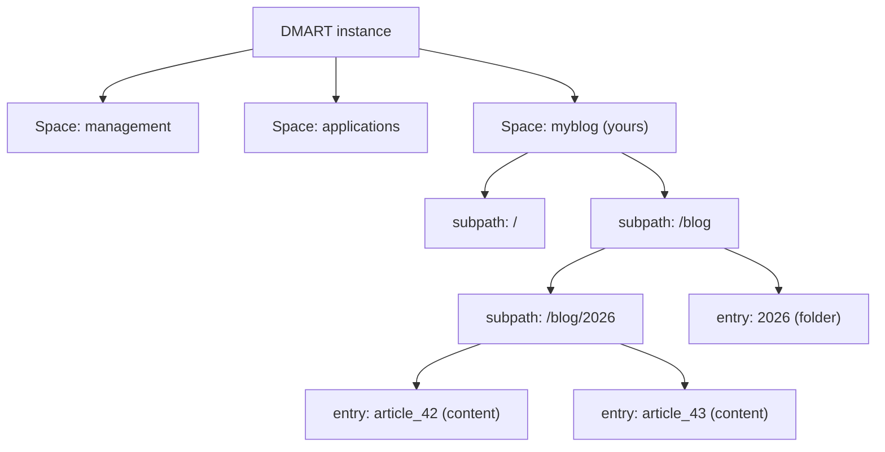
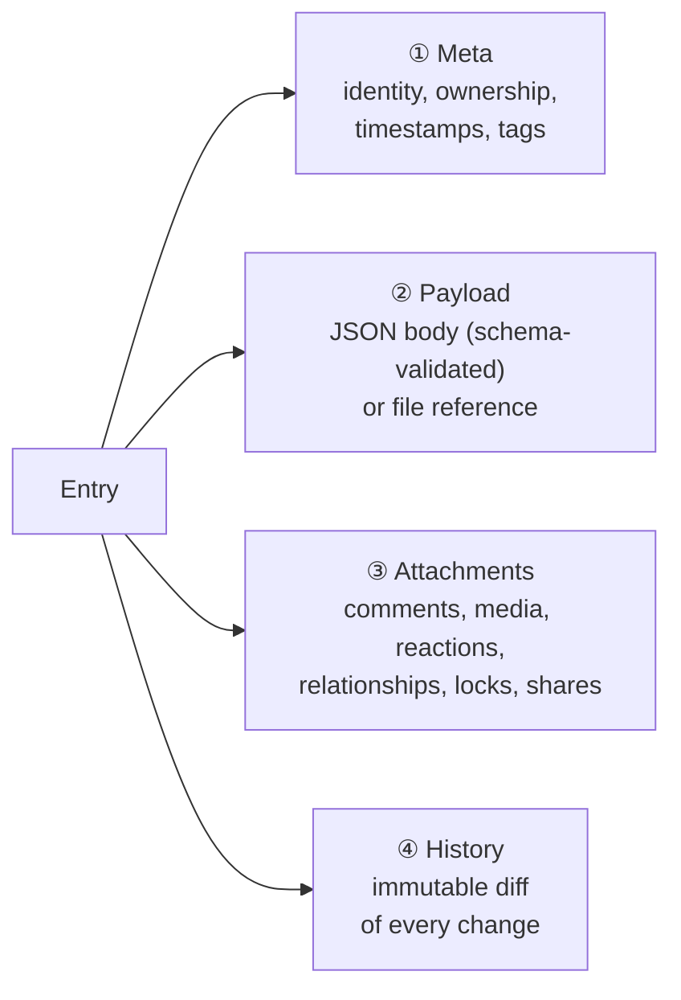

Everything in DMART is an **Entry** — a single, uniformly addressed unit of information. There are no bespoke tables per feature, no separate "users API" versus "documents API": a user, a folder, a blog post, a support ticket, an uploaded PDF and a system log are all the same shape of object, distinguished only by a `resource_type`. Understand the Entry and its address, and you understand the whole platform.

## 1. The Locator — how everything is addressed

Every entry is uniquely identified by a **four-tuple** called the _Locator_. Think of it as the full postal address of a piece of data. If you know these four values, you can read, update, or delete the entry — no numeric primary key required.

```
Locator = ( resource_type , space_name , subpath , shortname )
              │             │           │          │
              │             │           │          └ "article_42"   name, unique in the folder
              │             │           └─────────── "/blog/2026"   folder path in the space
              │             └─────────────────────── "myblog"       the space (tenant)
              └───────────────────────────────────── "content"      what kind of entry it is
```

| Part | Analogy | Rules |
|---|---|---|
| `resource_type` | File type / class | One of the 30 resource types (see §6). Discriminates the entry's shape and which table/validation applies. |
| `space_name` | Drive / tenant | Top-level container. Every entry belongs to exactly one space. |
| `subpath` | Folder path | Hierarchical, slash-separated (e.g. `/users/employees`). Stored with a leading slash internally; the leading slash is stripped on the wire. |
| `shortname` | Filename | Unique within `(space, subpath)`. Allowed characters: `a–z A–Z 0–9 _` plus Arabic letters and Arabic-Indic digits, 1–64 chars. |

The Locator is a first-class object, not just a convention. Two entries can share a shortname as long as any other part of the tuple differs.

## 2. Spaces & Subpaths



### Space — the tenant boundary

A **Space** is the top-level organizational unit and the unit of isolation. It is itself an entry (`resource_type=space`) and carries configuration: which languages it supports, which plugins are active, whether indexing is enabled, whether it is hidden, its display ordinal, and which subfolders to hide.

**management** Always present. Holds users, groups, roles, permissions and the meta-schemas. Bootstrapped on first run.

**applications** Built-in catalog of app definitions, saved queries, configurations and translations.

**personal** Per-user private space for user-owned content.

**your spaces** Any number of custom spaces you create for your own domains.

### Subpath — the folder hierarchy

A **Subpath** is a slash-separated path inside a space, exactly like a directory path in a filesystem. `/` is the root of the space. Subpaths are normalized (leading/trailing slashes handled consistently) so `blog/2026`, `/blog/2026` and `/blog/2026/` all resolve to the same folder.

A subpath only "exists" as a browsable, configurable thing when a **folder entry** represents it. That folder is what carries display and behavior configuration for its contents — covered in depth on the [Folders & Rendering](/folders) page.

## 3. The Entry — four layers

Every entry is composed of up to four layers. Only **Meta** is mandatory; the rest are optional and added as needed.



**① Meta** System-level identity: uuid, shortname, ownership, ACLs, tags, display names, timestamps. Always present.

**② Payload** The actual content — a JSON object validated against a schema, or a pointer to an attached file. Optional.

**③ Attachments** Secondary entries bound to this one: comments, media, reactions, relationships, locks. Optional, unbounded.

**④ History** Append-only diff log. Every create/update/delete writes a row; the entry points at the latest one.

## 4. Meta — the fields every entry shares

Regardless of resource type, every entry inherits this common set of fields (the `Meta` base). Type-specific fields are layered on top (see §5).

| Field | Type | Purpose |
|---|---|---|
| `shortname` | string | Identifier, unique within `(space, subpath)`. |
| `uuid` | UUID | Permanent primary key. Never changes, even on rename or move. |
| `is_active` | bool | Soft-active flag. The `is_active` permission condition checks it. |
| `slug` | string | Optional URL-friendly alias. |
| `displayname` | Translation | Per-language labels, e.g. `{ "en": "Articles", "ar": "مقالات" }`. |
| `description` | Translation | Per-language descriptions. |
| `tags` | string[] | Free-form labels. Queryable with `@tags:foo`. |
| `owner_shortname` | string | The user who owns the entry. |
| `owner_group_shortname` | string | Owning group. Used by the `own` permission condition. |
| `created_at` | timestamp | Set on insert. |
| `updated_at` | timestamp | Refreshed on every write. |
| `payload` | Payload | Content type, schema reference, and body (see §5). |
| `acl` | Acl[] | Per-entry access-control overrides: `{user_shortname, allowed_actions}`. |
| `relationships` | Relationship[] | Typed links to other entries. |
| `last_checksum_history` | string | Pointer to the latest row in the history log. |
| `query_policies` | string[] | Precomputed ACL policy strings for fast read-time filtering. |

## 5. Payload & type-specific fields

The **Payload** is where an entry's real content lives. It is one of two things:

- **Inline JSON** — a structured object. If `schema_shortname` is set, the body is validated against that JSON Schema on every write.

- **A file reference** — `body` holds a filename and the bytes are fetched separately (images, PDFs, CSV, Parquet, …).

```
"payload": {
  "content_type": "json",          // json | markdown | html | image | pdf | csv | parquet | ...
  "schema_shortname": "article",   // optional — enables JSON-Schema validation
  "body": {                        // inline object, OR a filename string for file payloads
    "title": "Hello World",
    "body":  "First post."
  }
}
```

### Type-specific extensions

Selected resource types add their own fields on top of Meta:

| Type | Adds |
|---|---|
| `user` | `password` (hashed, never serialized), `roles`, `groups`, `email`, `msisdn`, OAuth ids, `locked_to_device`, verification & login state. |
| `role` | `permissions` — list of permission shortnames. |
| `permission` | `subpaths`, `resource_types`, `actions`, `conditions`, `restricted_fields`, `allowed_fields_values`. |
| `ticket` | `state`, `is_open`, `workflow_shortname`, `reporter`, `collaborators`, `resolution_reason`. |
| `space` | `languages`, `active_plugins`, `indexing_enabled`, `hide_folders`, `hide_space`, `ordinal`, `icon`, `mirrors`. |
| `folder` | A payload validated against the `folder_rendering` schema — how its contents are displayed. See [Folders & Rendering](/folders). |

## 6. Resource-type catalog

There are 30 resource types. They all share the Meta base; the type only changes which extra fields exist, which table stores the entry, and which validation runs.

**Identity** `user`, `group`

**Structure** `folder`, `space`

**Content** `content`, `schema`, `data_asset`, `csv`, `jsonl`, `sqlite`, `parquet`

**Workflow** `ticket`

**Social** `comment`, `reply`, `post`, `reaction`, `notification`, `share`

**Attachments** `media`, `log`, `relationship`, `alteration`, `history`, `lock`

**Management** `role`, `permission`, `acl`

**Extensions** `locator`, `json`, `plugin_wrapper`

On the wire, resource types are lowercase snake_case strings (`plugin_wrapper`, `data_asset`).

## 7. Attachments — sub-entries bound to a parent

Attachments are themselves entries, stored in a dedicated table, that point back at a parent entry. They keep related information physically together without polluting the parent's payload.

| Attachment | What it is |
|---|---|
| `media` | An uploaded file (image, PDF, video, document) bound to the entry. |
| `comment` / `reply` | Threaded discussion on the entry. |
| `reaction` | An emoji / like reaction. |
| `relationship` | A typed link to another entry (see also the Meta `relationships` field). |
| `lock` | An advisory/enforced lock preventing concurrent edits (see Entity Lifecycle). |
| `share` | A share grant exposing the entry to another party. |
| `alteration` | A proposed/tracked change record. |

Every attachment carries an `author_locator` (who created it), optional `media` bytes, a text `body`, and a `state`.

## 8. History & alterations

DMART never silently overwrites. Every create, update, and delete writes a diff to the history log alongside the request headers that caused it. The entry's `last_checksum_history` field chains to the most recent entry, forming an auditable, tamper-evident trail.

- Query an entry's history via the `history` query type.

- The diff captures exactly which fields changed, from what to what.

- Because history is append-only, you get a complete audit log for free.

## 9. On-disk layout (the `.dm` convention)

DMART's live data lives in PostgreSQL, but it can be exported to — and seeded from — a human-readable folder tree, and the sample/fixture data ships as that tree. This `.dm` layout is the export, seed and backup representation of the model, not a runtime store. Understanding it demystifies the whole model, because the directory structure _is_ the data model made visible.

```
spaces/
└── myblog/                              ← a Space
    ├── .dm/
    │   └── meta.space.json              ← space meta (languages, plugins, ordinal…)
    │
    ├── blog.json                        ← the FOLDER BODY for /blog  (rendering config)
    ├── blog/                            ← the /blog subpath
    │   ├── .dm/
    │   │   └── meta.folder.json         ← folder meta (points at ../blog.json as its body)
    │   │
    │   ├── article_42.json              ← a content entry's payload body
    │   └── .dm/
    │       └── article_42/
    │           ├── meta.content.json    ← the entry's meta
    │           └── attachments.comment/ ← attachments live beside the entry
    │
    └── schema/
        └── article.json                 ← a JSON Schema, referenced by payload.schema_shortname
```

Key idea: a folder's **meta** lives at `<subpath>/.dm/meta.folder.json`, while its **body** (the rendering config) is a sibling file named `<shortname>.json` in the parent directory. This split is exactly what the [Folders & Rendering](/folders) page dissects.

| File | Holds |
|---|---|
| `.dm/meta.space.json` | Space metadata. |
| `<subpath>/.dm/meta.folder.json` | Folder metadata for that subpath. |
| `<subpath>/.dm/<name>/meta.<type>.json` | An entry's meta. |
| `<subpath>/<name>.json` | An entry's (or folder's) JSON payload body. |
| `schema/<name>.json` | A JSON Schema definition. |

## 10. One source of truth, always exportable

DMART keeps a single, authoritative store — and guarantees you can always get your data back out as plain files. Those are two different things, not two competing storage modes.

**PostgreSQL — the sole source of truth** Every live read and write goes to PostgreSQL (via Npgsql). Narrow per-type tables (`users`, `roles`, `permissions`, `spaces`) plus a generic `entries` table, with `attachments` and `histories` alongside. ACID, relational integrity, and trigram (`pg_trgm` + GIN jsonb) full-text search — plus optional pgvector semantic search. There is no filesystem runtime store and no Redis; in-process caches only.

**The `.dm` tree — the export & backup format** The human-readable folder tree shown above is how a space is _exported, seeded and backed up_, not how it is served. `dmart export` writes a space to a zip in this on-disk layout; `import` and `seed` read it back. Human-readable, diff-friendly, and trivially archived with `git` or `tar`.

The wire format is the same in both directions: clients always send and receive the same `Record` envelope, whether it is being persisted to PostgreSQL or round-tripped through a `.dm` archive. This is what lets DMART promise **data longevity with zero vendor lock-in**: your data is standard PostgreSQL _and_ can be exported to plain JSON files on disk at any time.
