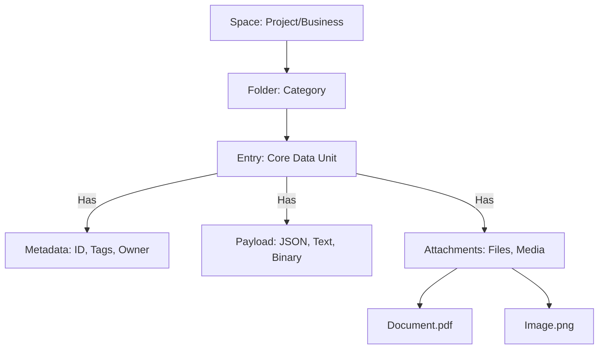
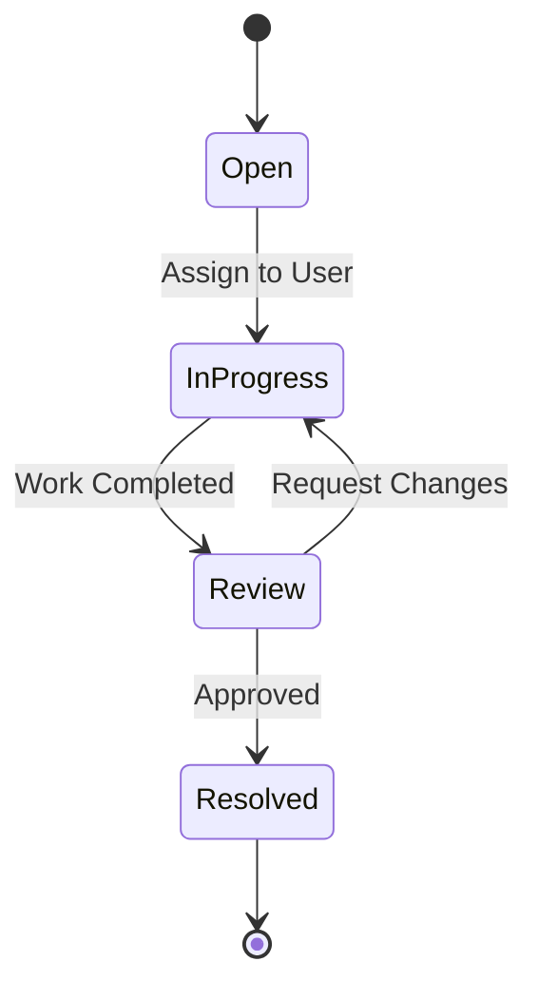
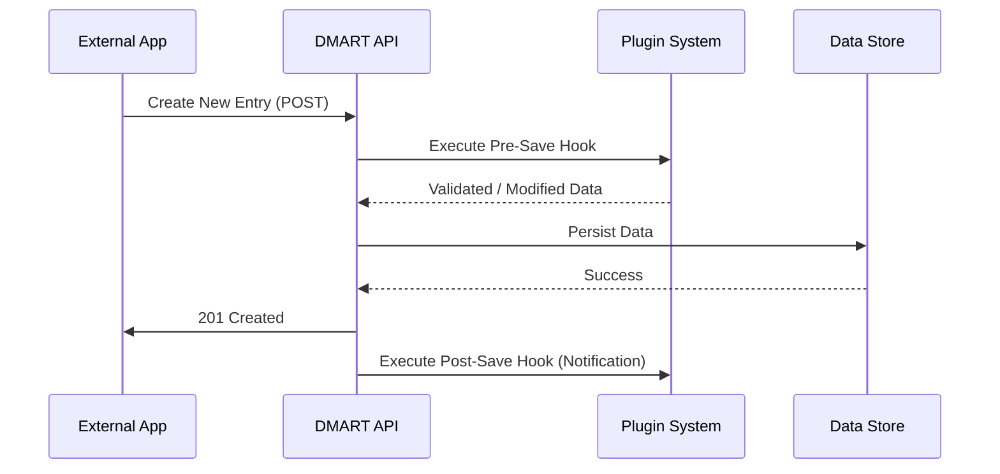

DMART is a versatile Data-as-a-Service (DaaS) platform designed to simplify data management for modern applications. It acts as a central repository for structured data, documents, and media, providing a unified interface for storage, retrieval, and collaboration.

## 1. Unified Data Management

DMART treats data as a first-class citizen, moving beyond traditional database constraints.

**Flexible "Entries"** The core unit of data — can represent anything from a simple record to a complex document.

**Structured & Unstructured** Seamlessly handle JSON data alongside text, markdown, and binary files (images, PDFs, videos).

**Attachments** Associate any number of files (documents, media) directly with an entry, keeping related information together.

**Hierarchical** Organize data into intuitive Spaces and Subpaths, similar to a file system.

## 2. Powerful Search & Discovery

Finding information is effortless with DMART's robust search engine.

- **Full-Text Search:** Instantly search across all data, including structured fields and text content.

- **Advanced Filtering:** Filter results by tags, creation dates, authors, and specific data attributes.

- **Native SQL Search:** Uses SQL full-text search capabilities for high-performance querying.

## 3. Collaboration & Workflow Automation

Built-in tools to manage processes and teamwork.

- **Ticketing System:** Transform any data entry into a trackable ticket with states (e.g., "Open," "In Progress," "Resolved").

- **Custom Workflows:** Define custom state transitions and rules to match your specific business processes.

- **Assignments:** Assign entries or tickets to specific users or roles.

- **Comments & Reactions:** Collaborate directly on data entries with threaded comments and emoji reactions.

## 4. Comprehensive Access Control

Security is granular and configurable to match organizational needs.

- **Spaces:** Distinct workspaces to isolate data and projects.

- **Role-Based Access Control (RBAC):** Define roles (e.g., Admin, Editor, Viewer) with specific permissions.

- **Granular Permissions:** Control access at the folder or even individual entry level (Create, Read, Update, Delete).

## 5. Integration & Extensibility

Designed to integrate seamlessly with your existing ecosystem.

- **RESTful API:** A comprehensive, documented API for interacting with every aspect of the platform.

- **Plugin Architecture:** Extend functionality with custom plugins for logic, validation, or external integrations.

- **Realtime Notifications:** The live notification path today is realtime WebSocket broadcast. The `realtime_updates_notifier` plugin runs on data changes and workflow events and pushes update messages to connected WebSocket clients subscribed to the relevant space/subpath channels — no polling required.

- **Email/SMS Delivery (in progress):** Configurable SMS and SMTP gateway settings exist (`SEND_SMS_API`, `SEND_SMS_OTP_API`, `MAIL_HOST`), but the outbound delivery plugins (`system_notification_sender`, `admin_notification_sender`, `local_notification`) are currently registered _no-op stubs_ pending a push/SMS/SMTP gateway pipeline. Activating one in a Space is a no-op until that integration lands.

## 6. Deployment & Operations

Built for flexibility and reliability in various environments.

- **Container-Ready:** Ships as a single self-contained, Native-AOT binary (no runtime to install), packaged into a tiny Docker/Podman image for consistent environments.

- **Air-Gapped Friendly:** The self-contained binary bundles the server, CLI, and admin UIs with no external service dependencies beyond PostgreSQL — ideal for on-premises and isolated networks.

- **PostgreSQL-Backed:** A single PostgreSQL database is the source of truth for all entries, users, and attachments — providing transactional integrity and enterprise-grade reliability.

- **Portable Import/Export:** Round-trip any Space to and from a human-readable `spaces/` + `.dm` file layout (packaged as a zip) for seeding, migration, and backup — ideal for longevity and moving data between deployments.
