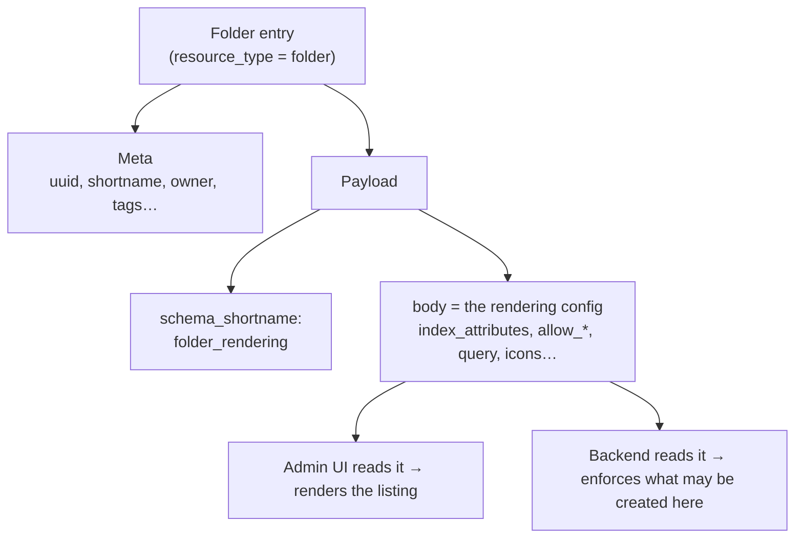
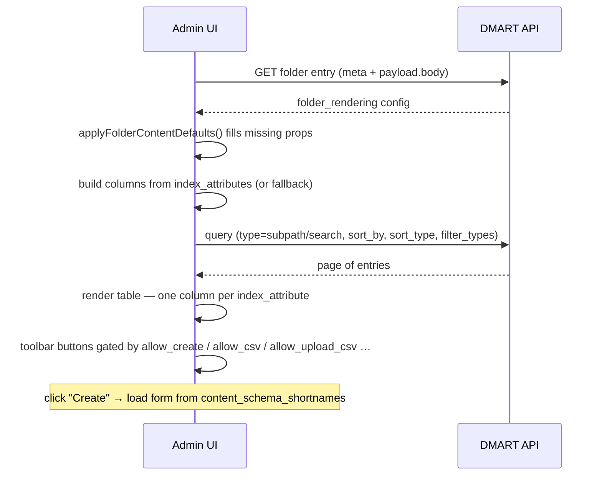

A folder in DMART is deceptively simple — and quietly one of the most powerful concepts in the platform. It is at once a **structural node** (the thing that makes a subpath browsable) and a **declarative control panel** that tells the admin UI exactly how to list, sort, filter, paginate and edit everything inside it, and tells the backend exactly what is allowed to live there. All of that lives in one small JSON body validated against a schema called `folder_rendering`. This page dissects every property.

## 1. A folder is just an entry

There is no special `Folder` class with dozens of fields. A folder is an [entry](/data-model) like any other, with `resource_type = folder`. It inherits the exact same Meta as a user or a blog post — uuid, shortname, ownership, tags, timestamps. It adds **no fields of its own**.

All of a folder's "rendering" power lives entirely in its **payload body**, a JSON object whose `schema_shortname` is `folder_rendering`. That body is the subject of this whole page.



The folder does not store its children. It stores _the rules and the view_ for its children. The children are ordinary entries that happen to share its subpath.

## 2. Anatomy: where the config actually lives

At runtime a folder is a single row in PostgreSQL like any entry, but when a space is exported to disk (DMART's import / export & seed format) the split between a folder's _meta_ and its _body_ becomes physically visible. The meta sits inside the subpath's `.dm` directory; the body is a sibling JSON file named after the folder, one level up.

```
spaces/management/
├── schema.json                       ← the BODY  (the folder_rendering config)
└── schema/                           ← the /schema subpath
    └── .dm/
        └── meta.folder.json          ← the META  (points at ../schema.json as body)
```

The meta simply references the body file and names the schema:

```
// management/schema/.dm/meta.folder.json
{
  "uuid": "b9b2b289-7f7c-4d40-a5a5-e896a9c146b4",
  "shortname": "schema",
  "is_active": true,
  "owner_shortname": "dmart",
  "payload": {
    "content_type": "json",
    "schema_shortname": "folder_rendering",   // ← validated against THE schema
    "body": "schema.json"                      // ← the sibling file with the config
  }
}
```

## 3. The `folder_rendering` schema — centralized & exact

Every folder in every space is validated against a **single** canonical schema that lives in the `management` space at `management/schema/folder_rendering`. Two design decisions make it strict and safe:

**Centralized** The schema validator special-cases the shortname `folder_rendering` and always resolves it from the `management` space — so one definition governs all spaces, and you never copy it per space.

**Exact** `additionalProperties: false` at every level. An unknown or _misspelled_ field is rejected, not silently ignored — you find the typo immediately instead of debugging a prop that "does nothing".

**Minimal required** The only required property is `index_attributes`. A folder with nothing but one index attribute is valid; everything else is optional and defaulted.

Because validation is exact, the props below are the **complete** vocabulary. There is no hidden `columns`, `render_type` or `list_columns` — those don't exist here. What you see is what a folder can declare.

## 4. Props — display & columns

These control what the listing (the "index page") looks like: which columns appear, their headers, the folder's icons, and the label for the shortname column.

| Property | Type | What it does |
|---|---|---|
| `index_attributes` _(required)_ | `[{key, name}]` | The star of the show. Each item is a column: `key` is the entry field/attribute to read, `name` is the header text shown. Order = column order. Must be unique. See §8. |
| `shortname_title` | `string` | The header label used for the shortname column (e.g. "Permission Shortname", "API Name") — lets a technical `shortname` read as a friendly noun. |
| `search_columns` | `[{key, name}]` | Which columns appear in the search/results view when searching within the folder. Same `{key, name}` shape as index_attributes. |
| `csv_columns` | `[{key, name}]` | Which columns (and their headers) are written when the list is exported to CSV. |
| `icon` | `string` | The folder's main icon, shown next to it in the tree/sidebar. |
| `icon_opened` | `string` | Icon shown when the folder is expanded. |
| `icon_closed` | `string` | Icon shown when the folder is collapsed. |
| `enable_pdf_schema_shortnames` | `string[]` | For entries using one of these schemas, the UI shows a "download as PDF" icon. |

## 5. Props — what may live here (server-enforced)

These four are not just UI hints — the **backend** enforces them whenever a child is created, updated, or moved into the folder. An empty (or absent) array means "no restriction". See §9 for the enforcement details.

| Property | Type | What it restricts |
|---|---|---|
| `content_resource_types` | `string[]` (enum) | A child's `resource_type` must be one of these. Values are drawn from the full resource-type enum (`content`, `ticket`, `folder`, `media`, …). |
| `content_schema_shortnames` | `string[]` | A child that declares a `payload.schema_shortname` must use one of these. Also drives which form the UI loads (see §8). |
| `workflow_shortnames` | `string[]` | A `ticket` created here that declares a `workflow_shortname` must use one of these. |
| `unique_fields` | `string[][]` | A list of composite uniqueness constraints. Each inner list is a set of fields that together must be unique across all entries in the folder — e.g. `[["email"], ["first_name","last_name"]]`. |

## 6. Props — action toggles

Booleans that show or hide the corresponding buttons/affordances in the admin UI for this folder. They shape what an operator _can do_ from the listing.

| Property | Default | Effect |
|---|---|---|
| `allow_view` | `true` | Allow opening/viewing a resource inside the folder. |
| `allow_create` | `true` | Show the "create resource" button (gates the create form). |
| `allow_create_category` | `false` | Allow creating a _sub-folder_ (a "category") inside this folder. |
| `allow_update` | `true` | Allow editing existing resources. |
| `allow_delete` | `false` | Allow deleting resources. |
| `allow_csv` | `false` | Show the CSV **download** button (export the displayed list). |
| `allow_upload_csv` | `false` | Show the CSV **upload** feature (batch-create from a CSV). |
| `use_media` | `false` | Declares that entries here carry a media attachment (surfaces media affordances). |

These are UI gates for a smooth operator experience — they are _not_ a security boundary. Real authorization is always enforced by [RBAC + ACLs](/access-control) on the server regardless of what a folder's toggles say.

## 7. Props — query, sort, filter & behavior

These decide _which_ entries the listing loads, in what order, and how it behaves — including the powerful ability to back a folder by a search instead of by its own subpath.

| Property | Type | What it does |
|---|---|---|
| `query` | `{type, search, filter_types}` | `type` is `"subpath"` (list the folder's own contents) or `"search"` (list the results of a saved search query instead). `search` is the [query string](/query-search); `filter_types` narrows resource types. |
| `append_subpath` | `string` | A string appended to the query subpath — lets a folder point its listing at a nested path below itself. |
| `sort_by` | `string` | The field name used to order the listing (e.g. `created_at`, `shortname`). |
| `sort_type` | `"ascending" \| "descending"` | The direction of the sort. |
| `filter` | `object[]` | Additional filter options offered above the listing. |
| `disable_filter` | `boolean` | Hides the search/filter icon entirely for this folder. |
| `expand_children` | `boolean` | Whether the folder auto-expands its children in the tree. |
| `stream` | `boolean` | Enables a folder-level **websocket watch** — the listing updates live as entries change. |

## 8. `index_attributes` in depth

This is the one required property and the heart of folder rendering. It is an ordered array of column descriptors, each a two-field object:

```
"index_attributes": [
  { "key": "shortname",        "name": "API Name"  },   // column 1
  { "key": "subpath",          "name": "Sub path"  },   // column 2
  { "key": "end_point",        "name": "End point" },   // column 3  (a payload.body field)
  { "key": "verb",             "name": "Verb"      }    // column 4  (a payload.body field)
]
```

**key** Which value to read from each entry. It can be a Meta field (`shortname`, `created_at`, `owner_shortname`) or a field inside the entry's `payload.body` (`end_point`, `verb`).

**name** The human-friendly column header rendered in the table. Purely presentational.

### Fallback columns

If a folder somehow has no usable index attributes, the admin UI falls back to a sensible default set so the listing is never blank:

```json
[
  { "key": "status",     "name": "Status" },
  { "key": "created_at", "name": "Created At" },
  { "key": "updated_at", "name": "Updated At" },
  { "key": "author",     "name": "Author" }
]
```

### Editing columns live

Operators don't hand-edit JSON. The admin UI exposes a **column-settings modal** that adds, removes and reorders `index_attributes` visually, then writes them back into `payload.body.index_attributes` via a folder `update` request. The folder config is data you edit through the same CRUD API as everything else.

## 9. How the admin UI renders a folder

Putting the props together, here is the exact pipeline the admin SPA (CXB / Catalog) runs when you open a folder:



1. **Load** the folder entry and read `payload.body`.

2. **Default** every missing property (see §10) — crucially with `??`, so an explicit `false` from the server is preserved, not overwritten by a truthy default.

3. **Columns** from `index_attributes`, or the fallback set.

4. **Fetch** entries: `query.type` decides subpath-listing vs search; `sort_by`/`sort_type` order them (default `created_at` / `descending`).

5. **Toolbar**: the create button appears only if `allow_create`; CSV download only if `allow_csv`; CSV upload only if `allow_upload_csv`; and so on.

6. **Create form**: driven by `content_schema_shortnames` — _zero_ schemas → a free-form entry; _one_ → that schema's form is auto-loaded and rendered; _many_ → the user picks which schema first.

## 10. Content policy is enforced on the server

The three content arrays plus uniqueness are not merely UI conveniences. On every create / update / move, the backend reads the _parent folder's_ config and validates the child against it:

- `content_resource_types` — the child's resource type must be allowed.

- `content_schema_shortnames` — a schema-declaring child must use an allowed schema.

- `workflow_shortnames` — a ticket's workflow must be allowed.

Semantics that matter in practice:

**Empty = open** An empty or absent array imposes no restriction. Restrictions are opt-in.

**Fails open** If the parent folder can't be read, enforcement is skipped rather than blocking the write.

**Toggleable** Global enforcement is controlled by `ENFORCE_FOLDER_CONTENT_POLICY` (default `true`).

## 11. Default values

When a property is absent, the admin UI applies these defaults (using `??` so a real `false`/empty value is never clobbered):

| Group | Default |
|---|---|
| `allow_view`, `allow_create`, `allow_update` | `true` |
| `allow_delete`, `allow_create_category`, `allow_csv`, `allow_upload_csv`, `use_media`, `stream`, `expand_children`, `disable_filter` | `false` |
| `index_attributes`, `content_schema_shortnames`, `content_resource_types`, `*_columns`, `workflow_shortnames` | `[]` |
| `query` | `{ type: "", search: "", filter_types: [] }` |
| `icon`, `icon_opened`, `icon_closed`, `shortname_title` | `""` |

## 12. Worked examples (real seed folders)

### a. Minimal, read-only listing — `management/permissions`

One column, everything locked down. A pure browse view.

```json
{
  "shortname_title": "Permission Shortname",
  "content_schema_shortnames": [],
  "index_attributes": [
    { "key": "shortname", "name": "Permission Shortname" }
  ],
  "allow_create": false,
  "allow_update": false,
  "allow_delete": false,
  "use_media": false,
  "filter": [],
  "allow_view": true
}
```

### b. Rich, editable listing — `applications/api`

Four columns (two of them payload fields), full CRUD, CSV export, auto-expanding tree, constrained to one schema and the `content` type.

```json
{
  "shortname_title": "API Name",
  "content_schema_shortnames": ["api"],
  "content_resource_types": ["content"],
  "index_attributes": [
    { "key": "shortname",  "name": "name" },
    { "key": "subpath",    "name": "Sub path" },
    { "key": "end_point",  "name": "End point" },
    { "key": "verb",       "name": "Verb" }
  ],
  "expand_children": true,
  "allow_create": true,
  "allow_update": true,
  "allow_delete": true,
  "allow_csv": true,
  "use_media": false,
  "allow_view": true
}
```

### c. Distinct search view — `management/notifications`

Two schemas allowed, and a bespoke `search_columns` set that differs from the index columns.

```json
{
  "shortname_title": "ID",
  "content_schema_shortnames": ["system_notification_request", "admin_notification_request"],
  "content_resource_types": ["content"],
  "index_attributes": [
    { "key": "shortname",  "name": "Shortname" },
    { "key": "on_subpath", "name": "On Subpath" },
    { "key": "on_action",  "name": "On Action" },
    { "key": "on_state",   "name": "On State" },
    { "key": "priority",   "name": "Priority" }
  ],
  "search_columns": [
    { "key": "shortname",  "name": "username" },
    { "key": "on_subpath", "name": "On Subpath" }
  ],
  "allow_create": true,
  "allow_update": true,
  "allow_delete": true,
  "allow_view": false
}
```

### d. Query-backed folder — `management/health_check`

Instead of listing its own subpath, this folder lists the results of a `search` query, sorted by creation time.

```json
{
  "index_attributes": [ { "key": "shortname", "name": "name" } ],
  "sort_by": "created_at",
  "sort_type": "ascending",
  "query": { "type": "search", "search": "" },
  "content_schema_shortnames": [],
  "content_resource_types": [],
  "workflow_shortnames": [],
  "enable_pdf_schema_shortnames": [],
  "allow_create": false,
  "allow_view": false
}
```

## 13. Validation, strictness & the auto-fixer

Because the schema is exact, a folder body is rejected at write time (and at seed/startup) if it contains an unknown field or misses `index_attributes`. To repair legacy folders that predate the tightened schema, DMART ships a CLI:

```
dmart fix-folder-rendering [space] [--apply]
```

- **Strips** fields that aren't in the canonical schema (kills typos and dead props).

- **Fills** a required-but-missing `index_attributes` with `[]`.

- **Widens** non-empty content-policy arrays so they still cover the folder's existing children (won't retroactively orphan data).

- **Reports** invalid `content_resource_types` enum values without silently deleting them.

Run it without `--apply` for a dry-run report; add `--apply` to write the fixes. See the [CLI reference](/cli).
