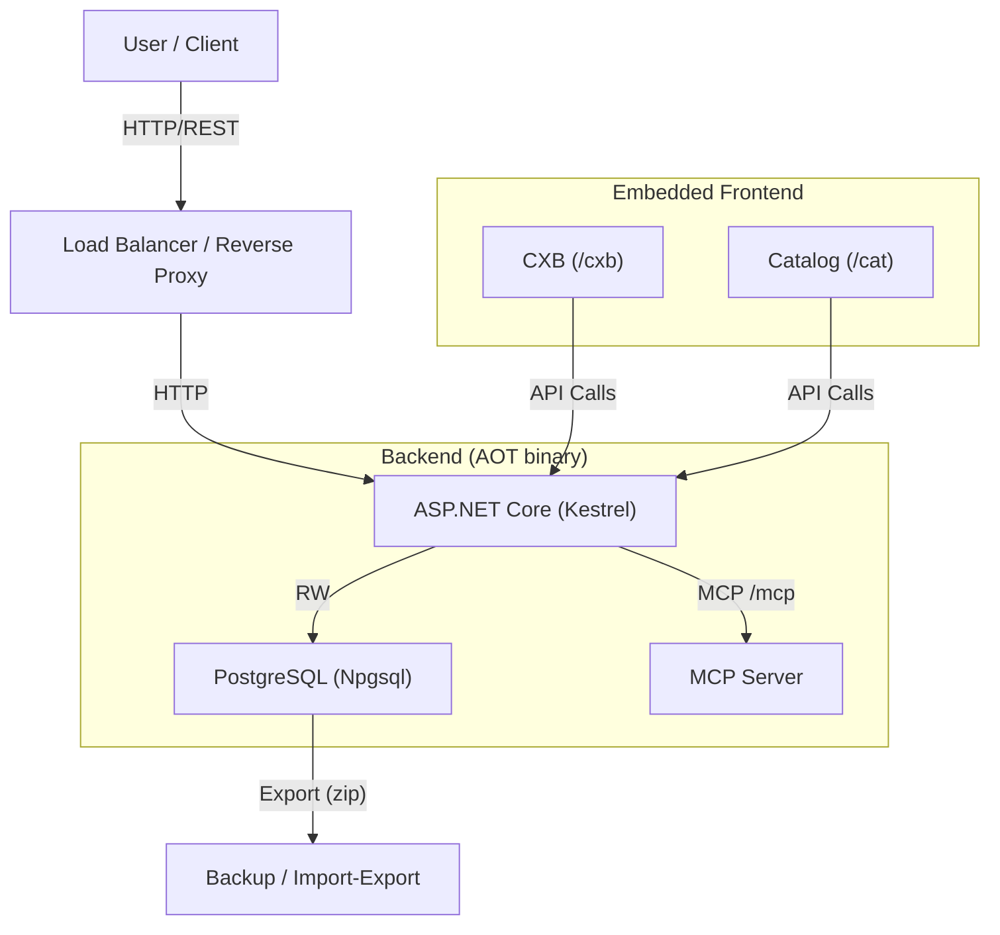
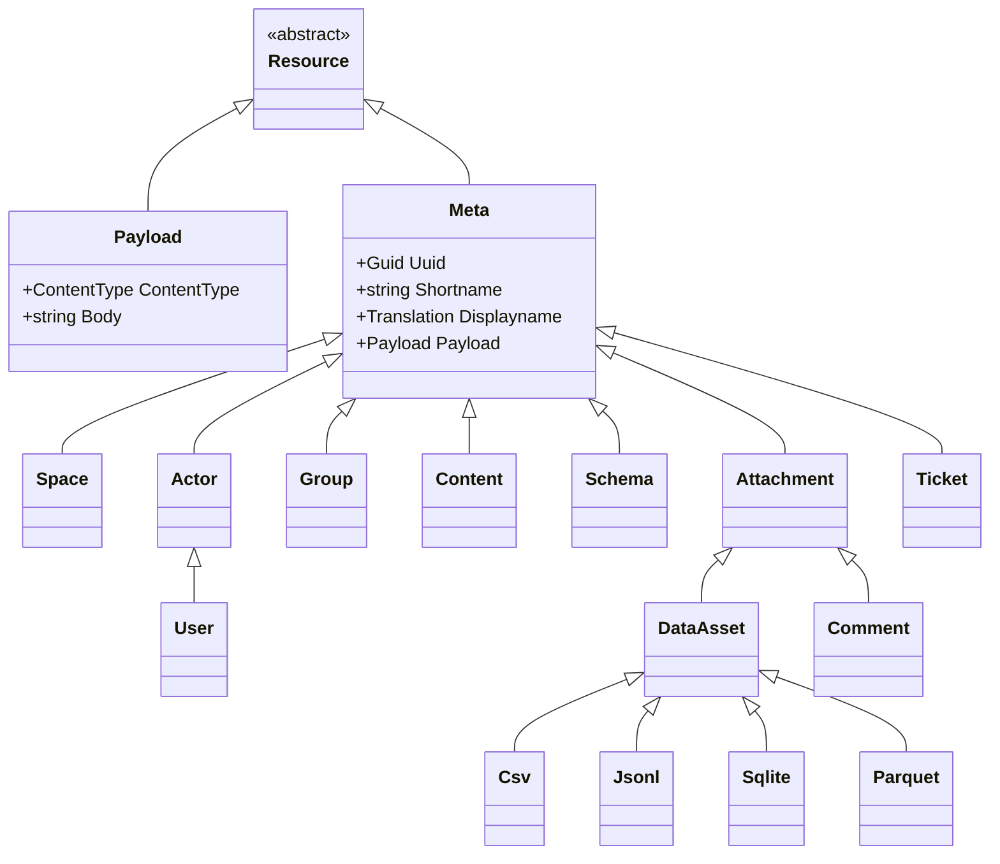
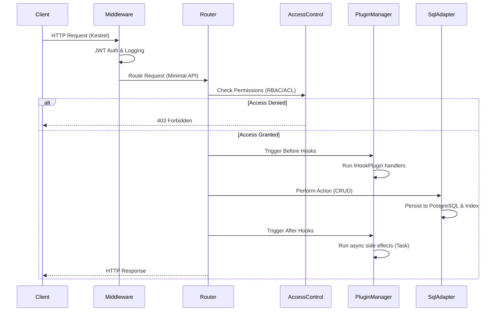

## 1. Introduction

DMART (Data Mart) is a Data-as-a-Service (DaaS) platform designed to act as a streamlined, low-code information inventory system. It treats data assets as commodities, allowing for structured, unstructured, and binary data management. Optimized for small to medium data footprints (<=300 million primary entries), it uses a SQL database for data longevity and ACID compliance.

## 2. Architecture

DMART follows a microservices-friendly architecture with clear separation between the API layer, data processing, and storage.

### Backend Stack

- **Language & Runtime:** C# on .NET 10, compiled ahead of time with **Native AOT** into a single self-contained binary (~50 MB; 46 MB arm64, 53 MB x64) — no runtime install required. JSON is source-generated (System.Text.Json), and the same binary bundles both the server and the CLI client.

- **Web Framework:** ASP.NET Core Minimal APIs on the **Kestrel** HTTP server, built with the slim/AOT host (`WebApplication.CreateSlimBuilder`). Endpoints are route groups (`MapGroup`), not MVC controllers. Swagger/OpenAPI is served at `/docs`.

- **Data Persistence:** **PostgreSQL** (via Npgsql) is the single source of truth for all runtime data — ACID compliant with relational integrity. There is no Redis and no filesystem runtime store; caches are in-process only.

- **Authentication:** JWT Bearer (HS256, Argon2-hashed passwords), plus a full OAuth 2.1 Authorization Server with Google, Facebook, and Apple sign-in.

- **Interoperability:** Built-in MCP server at `/mcp` (Streamable HTTP; off by default, enable with `ENABLE_MCP=true`) and WebSocket endpoints for realtime updates.

### Frontend Stack

DMART ships two **Svelte 5 + Vite** admin SPAs that are **embedded directly into the .NET binary** and served by ASP.NET middleware — no separate frontend deployment:

- **CXB (`/cxb`):** the Customer eXperience Builder — the primary administrative interface.

- **Catalog (`/cat`):** a user-oriented SPA.

- **Under the hood:** Svelte 5, @roxi/routify v3, Vite, and Svelte stores for state.

## 3. Data Model

DMART uses an **Entry-oriented** data model rather than a document-oriented one. All entities inherit from a base `Meta` class.

### Resource Hierarchy

- **Space:** Top-level container defining configuration like languages, plugins, and visibility.

- **Subpath:** Logical folder structure within a space (e.g., `/content/posts`).

- **Entry:** Atomic unit of information with UUID, Shortname, Meta, Payload, and Attachments.

### Key Data Structures

- **Meta:** Base class (uuid, shortname, slug, acl, etc.).

- **Record:** Flat representation for API I/O.

- **Payload:** Content type, schema reference, and body.

- **Attachment:** Extends Meta for attached resources. Subtypes: Media, Comment, Reaction, Relationship.

- **DataAsset:** Specialized attachments for tabular/binary data files — supported content types are **CSV**, **JSONL**, **SQLite**, and **Parquet**. Here `sqlite` is only a data-asset content type, never the database backend (the backend is always PostgreSQL).

- **Ticket:** Extends Meta for workflow states, reporters, and collaborators.

## 4. Key Features

### 4.1 Storage & Data Longevity

Data is stored in normalized PostgreSQL tables, ensuring ACID compliance and standard relational integrity. PostgreSQL is the sole runtime store; the on-disk `spaces/` + `.dm/` layout is used only as a portable import/export, seed, and migration format (zip round-trips), never as a live data store.

### 4.2 Advanced Search & Querying

The `/query` endpoint supports a rich query language that is compiled to SQL. Search runs on PostgreSQL with trigram indexes (`pg_trgm` + GIN on jsonb), with optional **pgvector** semantic search for cosine-similarity matching:

- **Filtering:** By space, subpath, resource type, schema, and specific shortnames.

- **Full-text Search:** Fuzzy matching on text fields.

- **Aggregation:** Grouping and reducing data (counts, sums).

- **Sorting & Pagination:** `limit`, `offset`, `sort_by`.

- **Specialized Queries:** `history`, `events`, `tags`, `reports`.

### 4.3 Access Control (RBAC + ACL)

Security enforced via a comprehensive `AccessControl` module:

- **Permission Scope:** Action type, subpath, resource type, conditions, field-level restrictions.

- **ACLs:** Per-instance access overrides on individual entries.

### 4.4 Workflows & Tickets

Ticketing system with state management and a `/progress-ticket` API for workflow transitions.

### 4.5 Data Import/Export

- **ZIP:** Full space export/import preserving folder structure.

- **CSV Export:** Stream query results as CSV (`/csv` endpoint).

- **CSV Import:** Batch-create resources from CSV uploads (`/resources_from_csv`).

### 4.6 Plugin System

Event-driven plugin architecture built around two C# interfaces: `IApiPlugin` (new endpoints mounted at `/{shortname}`) and `IHookPlugin` (before/after action interceptors). Beyond managed C# plugins, DMART also loads **native plugins** from `~/.dmart/plugins` — either crash-safe subprocess executables (JSON-lines over stdin/stdout) or shared libraries via a C ABI — enabling extensions written in any language.

## Request Flow

## 5. API Structure

REST-like and resource-oriented. Key routers:

**`/managed`**: Core content management (CRUD, Query, Import/Export).

- `/request`: Unified endpoint for batch operations.

- `/query`: Main search endpoint.

- `/entry`: Single entry metadata and payload.

- `/payload`: Raw content/media retrieval.

- `/import` / `/export`: Bulk data operations.

- **`/user`**: Authentication and profile management.

- **`/public`**: Read-only access for public content.

- **`/qr`**: QR code generation.

- **`/info`**: System information and manifest.

- **`/mcp`**: Model Context Protocol server (Streamable HTTP) exposing DMART tools to AI clients, paired with the OAuth 2.1 Authorization Server for client onboarding. Requires `ENABLE_MCP=true`; off by default.

- **`/docs`**: Swagger UI and OpenAPI schema (`/docs/openapi.json`).

## 6. Data Asset Management

DMART natively handles analytical data files:

- Specialized support for **SQLite** attachments — perform SQL queries directly on attached files via the API. Note that `sqlite` here is a data-asset content type only, not the database backend (the backend is always PostgreSQL).

- **Parquet**, **JSONL**, and **CSV** are treated as first-class data citizens.

## 7. Deployment

- **Single Binary:** Native-AOT publish produces one self-contained `dmart` executable (~50 MB) with no runtime dependency — copy and run. The embedded admin UIs and sample seed data ship inside it, and the same binary doubles as the CLI (`seed`, `import`, `export`, `migrate`).

- **Containerized:** Docker/Podman images available (`ghcr.io/edraj/csdmart`).

- **Config:** Environment variables / `config.env`, bound and validated once at startup (strict unknown-key rejection, no hot reload).

- **External dependency:** a PostgreSQL instance — no Redis, no separate search cluster required.
