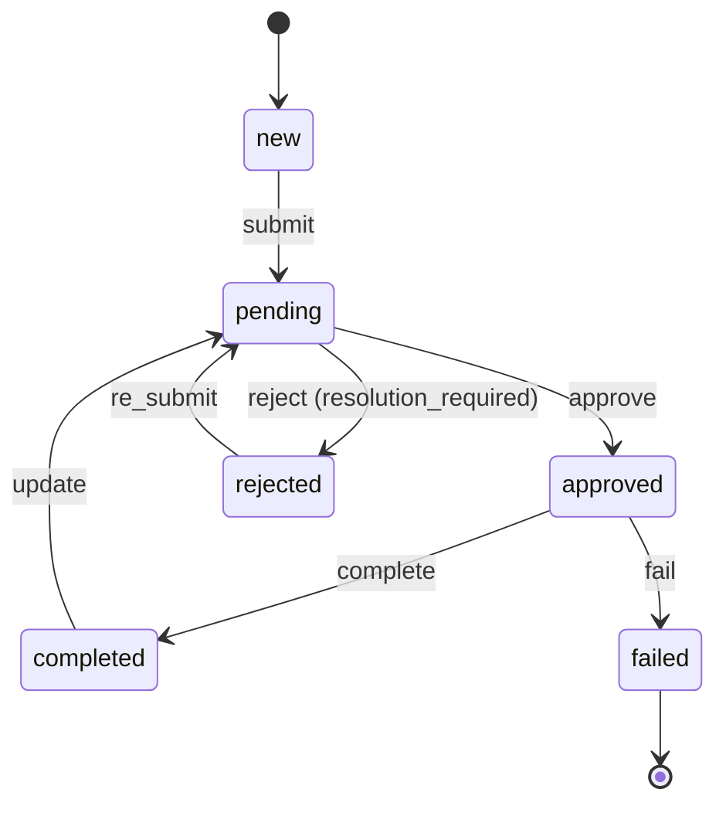

A **ticket** is an ordinary DMART entry that additionally carries _workflow state_. Instead of freely editing a status field, callers advance a ticket through a declarative state machine — a **workflow** that itself lives in the store as data. Every transition is validated against the workflow definition, the actor's roles, and (where required) a resolution reason, then persisted through the same permission-gated update path as any other write.

## What Is a Ticket

A ticket is an entry whose `resource_type` is `ticket` (one of the 30 resource types). On top of the usual Meta fields (`shortname`, `owner_shortname`, `acl`, `payload` …) the entry row carries a handful of ticket-specific columns, defined on `Dmart.Models.Core.Entry`:

| Field | Type | Meaning |
|---|---|---|
| `state` | `string?` | The current workflow state (e.g. `pending`, `approved`). Set to the workflow's `initial_state` at creation. |
| `is_open` | `bool?` | Whether the ticket is still active. `true` while the current state has outgoing transitions; `false` once it lands on a terminal (closed) state. |
| `workflow_shortname` | `string?` | Which workflow definition governs this ticket. Looked up when a transition is attempted. |
| `reporter` | `Reporter?` | Provenance for externally-submitted tickets (channel, distributor, etc.). See below. |
| `collaborators` | `Dictionary<string, string>?` | Named collaborator slots (e.g. `{"assignee": "alice"}`). Set via the `assign` request. |
| `resolution_reason` | `string?` | Why the ticket was closed / rejected. Required by transitions that declare `resolution_required`. |

A ticket is created with the normal [`create` request](/entity-lifecycle) — you supply `workflow_shortname` and let the engine seed the initial state, or set `state` explicitly. Example create record:

```http
POST /managed/request
{
  "space_name": "applications",
  "request_type": "create",
  "records": [
    {
      "resource_type": "ticket",
      "subpath": "api/v1/tickets",
      "shortname": "TCK-1042",
      "attributes": {
        "is_active": true,
        "workflow_shortname": "channel",
        "state": "new",
        "is_open": true,
        "payload": {
          "content_type": "json",
          "schema_shortname": "ticket",
          "body": { "summary": "Activate new POS", "priority": "high" }
        }
      }
    }
  ]
}
```

The folder a ticket lives in can constrain which workflows are legal through its `workflow_shortnames` setting — see [Folders & Rendering](/folders). A ticket that declares a `workflow_shortname` must use one the folder allows.

## Workflows Are Data

A workflow is _not_ code. It is a `content` entry (resource type `content`) stored under a `/workflows` folder in the management space. Its `payload.body` holds the state-machine definition. At transition time `WorkflowEngine` loads that entry — trying subpaths `/workflows`, `/workflow`, then `/` — deserialises the body, and evaluates the requested action against it.

### Anatomy of a workflow body

**initial_state** The state a new ticket starts in. May be a plain string, or an array of `{name, roles}` objects — in the array form the engine prefers the entry whose `roles` contains `"default"`, falling back to the first named entry.

**states[]** The list of states. Each has a machine `state` key, an optional display `name`, and a `next` array of outgoing transitions. A state with _no_ `next` is terminal (closed).

**next[] transition** An `action` (the verb the caller invokes), a target `state` (the engine also accepts `to` for back-compat), an optional `roles` gate, and an optional `resolution_required` flag.

**resolutions[]** Optional per-state catalogue of allowed resolution reasons (each a `key` plus localized labels). Presentational — surfaced by the admin UI when a resolution is required.

### Full workflow definition (payload.body)

This is the shape of a real seeded workflow (`management/workflows/channel`), trimmed to the essentials. Note that `new`, `pending`, `approved` and `completed` all have a `next` array (open states), while `failed` has none (terminal / closed):

```json
{
  "initial_state": [
    { "name": "new", "roles": ["default"] }
  ],
  "states": [
    {
      "name": "New",
      "state": "new",
      "next": [
        { "action": "submit", "state": "pending", "roles": ["account_manager"] }
      ]
    },
    {
      "name": "Pending",
      "state": "pending",
      "next": [
        { "action": "approve", "state": "approved", "roles": ["backoffice"] },
        { "action": "reject",  "state": "rejected", "roles": ["backoffice"],
          "resolution_required": true }
      ]
    },
    {
      "name": "Approved",
      "state": "approved",
      "next": [
        { "action": "complete", "state": "completed", "roles": ["backoffice"] },
        { "action": "fail",     "state": "failed",    "roles": ["backoffice"] }
      ]
    },
    {
      "name": "Rejected",
      "state": "rejected",
      "next": [
        { "action": "re_submit", "state": "pending", "roles": ["account_manager"] }
      ],
      "resolutions": [
        { "key": "missing_documents", "en": "Missing Documents" },
        { "key": "Others",            "en": "Others" }
      ]
    },
    {
      "name": "Completed",
      "state": "completed",
      "next": [
        { "action": "update", "state": "pending", "roles": ["account_manager"] }
      ]
    },
    { "name": "Failed", "state": "failed" }
  ]
}
```

**Open vs. closed is derived, not stored on the workflow.** The engine's `CheckOpenState` looks up the target state in `states[]` and reports it _open_ if it has a `next` field, _closed_ if it does not. That result becomes the ticket's `is_open` after the transition — so landing on `failed` above sets `is_open = false`, while landing on `pending` keeps it `true`.

## The State Machine

The workflow above describes this machine. Solid arrows are transitions; each is labelled with the `action` that triggers it. `failed` is terminal (closed); every other state is open.



Because `rejected` and `completed` still have outgoing transitions, they are _open_ states even though they read like end states — a rejected ticket can be re-submitted, a completed one re-opened. Only `failed` has no `next`, so it is the sole closed state here.

## Advancing a Ticket: `progress-ticket`

Tickets are never advanced by patching `state` directly. They use a dedicated endpoint that runs the workflow engine:

`PUT /managed/progress-ticket/{space}/{subpath}/{shortname}/{action}`

The trailing path segments are the ticket's location and the `action` to invoke; the JSON body carries the resolution and an optional comment:

```http
PUT /managed/progress-ticket/applications/api/v1/tickets/TCK-1042/reject
{
  "resolution": "missing_documents",
  "comment": "ID scan unreadable"
}
```

The body accepts `resolution` _or_ `resolution_reason` (both map to the ticket's `resolution_reason` column), plus an optional `comment`. A missing/empty body is allowed for transitions that do not require a resolution.

### What the engine enforces

`WorkflowService.ProgressAsync` + `WorkflowEngine.EvaluateAsync` apply these checks, in order, before any write happens:

**1 · Ticket & workflow exist** The ticket must exist and carry a non-empty `workflow_shortname`, and that workflow entry must load and contain a `states` array.

**2 · Current state is known** The ticket's `state` must match a state in the workflow, and that state must have a `next` array (not terminal).

**3 · Action is a valid transition** Some entry in `next` must have `action` equal to the URL's action, with a non-empty target `state`.

**4 · Actor holds a required role** If the transition lists `roles`, the actor (resolved to their user's roles) must hold at least one of them — otherwise the transition is refused.

**5 · Resolution when required** If the transition sets `resolution_required: true`, a `resolution_reason` must be present in the body — else the request fails with `MISSING_DATA`.

When all checks pass, the service builds a patch — `state` = the new state, `is_open` = whether that state is open, and `resolution_reason` if supplied — and applies it through `EntryService.UpdateAsync` with the action override `progress_ticket` (so the permission walk gates on the `progress_ticket` action, not `update`). The success envelope echoes the outcome:

```json
{
  "status": "success",
  "attributes": {
    "state": "rejected",
    "is_open": true
  }
}
```

### Failure responses

The rejections are explicit. A few representative errors (all returned as `status: "failed"`):

| Cause | Error |
|---|---|
| Ticket has no `workflow_shortname` | `WORKFLOW_BODY_NOT_FOUND` — "ticket has no workflow_shortname" |
| Action isn't a valid transition from the current state | `INVALID_TICKET_STATUS` — "You can't progress from {state} using {action}" |
| Actor lacks a required role | `INVALID_TICKET_STATUS` — "You don't have the permission to progress this ticket with action {action}" |
| Resolution required but omitted | `MISSING_DATA` — "this transition requires a resolution_reason" |

## Assigning: the `assign` Request

Handing a ticket to a new owner or collaborator is a first-class operation, distinct from a normal update. It goes through the standard `/managed/request` envelope with `request_type: "assign"` (one of the 7 request types) and is dispatched by `DispatchAssignAsync`:

```http
POST /managed/request
{
  "space_name": "applications",
  "request_type": "assign",
  "records": [
    {
      "resource_type": "ticket",
      "subpath": "api/v1/tickets",
      "shortname": "TCK-1042",
      "attributes": {
        "owner_shortname": "backoffice_agent_7",
        "collaborators": { "assignee": "backoffice_agent_7" }
      }
    }
  ]
}
```

**Why it isn't a plain update.** `owner_shortname` is a _restricted field_ — a regular `update` silently preserves the creation-time owner and can never transfer it. The `assign` path opts into exactly that one restricted field (`AssignRestrictedFields`) and gates the permission check on the `assign` action (not `update`) via an action override. This lets an admin grant "may reassign ownership" separately from "may edit content".

The dispatcher's contract:

**owner_shortname required** Absent or empty → `MISSING_DATA` ("The owner_shortname is required").

**Target must exist** The new owner must be a real user in `management/users` → otherwise `OBJECT_NOT_FOUND`.

**Only ownership + collaborators change** The patch mutates `owner_shortname` plus optional `collaborators`; all other restricted fields stay untouched.

## Reporter & Provenance

Tickets often originate outside the system — a phone channel, a mobile app, an automated bot. The optional `reporter` block (`Dmart.Models.Core.Reporter`) records where a ticket came from without conflating it with the DMART `owner_shortname`:

```
"reporter": {
  "type": "web",
  "name": "Retail Front Desk",
  "channel": "walk_in",
  "distributor": "north_dist_04",
  "governorate": "Baghdad",
  "msisdn": "07701234567",
  "channel_address": { "queue": "activation" }
}
```

| Field | Purpose |
|---|---|
| `type` | Origin kind. Mirrors the UserType convention — `web`, `mobile`, or `bot`. |
| `name` | Human/agent name that filed the ticket. |
| `channel` | The channel it arrived through. |
| `distributor` | Distributor / partner reference. |
| `governorate` | Geographic province of origin. |
| `msisdn` | Optional phone number of the reporter. |
| `channel_address` | Optional free-form address bag for channel-specific routing. |

All reporter fields are optional strings (plus the `channel_address` map). The set above is exactly what the model exposes — treat `type`'s values as the `web|mobile|bot` convention rather than a rigidly enforced enum on this field.

## Locking Tickets

An agent working a ticket can place an entry lock so nobody else edits it underneath them. Locking is generic to all entries but is especially useful for tickets. It uses the `lock` and `unlock` actions (two of the 11 action types):

```
# take the lock
PUT    /managed/lock/ticket/applications/api/v1/tickets/TCK-1042

# release it
DELETE /managed/lock/applications/api/v1/tickets/TCK-1042
```

While a lock is held, a plain `update` by anyone other than the lock holder is blocked. The permission gate runs first, so an unauthorized caller still gets a "not allowed" answer rather than a hint that the entry is merely locked.

**Workflow actions bypass the lock.** The lock block applies only to plain `update`. The workflow-authorized overrides — `progress_ticket` and `assign` — carry their own action grant and keep working even when a lock is parked, so a supervisor can reassign or progress a locked ticket whose holder has gone offline.

## Related Concepts

**[Access Control](/access-control)** The `progress_ticket`, `assign`, `lock` and `unlock` action types are all defined and gated here alongside the other 11 actions.

**[Folders & Rendering](/folders)** A folder's `workflow_shortnames` setting constrains which workflows tickets created there may use.

**[Entity Lifecycle](/entity-lifecycle)** Tickets are created, updated and deleted through the same `/managed/request` envelope as every other entry.
