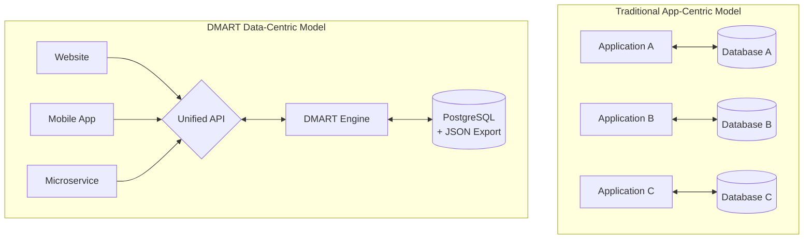
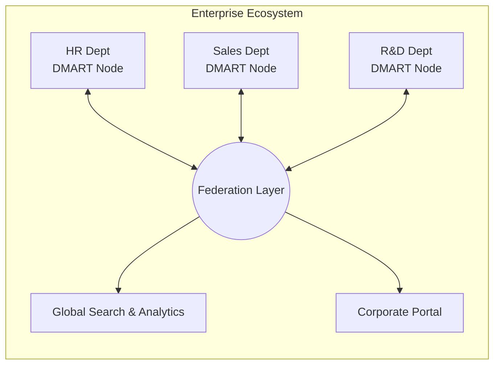

Unlocking the true value of your data. In today's digital landscape, data is often touted as the "new oil," yet for many organizations, it remains a burden — scattered, locked in proprietary formats, and difficult to manage. **DMART** changes that narrative.

DMART transforms your data from a liability into a true asset. By treating data as a commodity that is easy to author, share, and extend, DMART empowers businesses of all sizes to regain control over their information. It is not just a database; it is a **Data-as-a-Service (DaaS)** platform.

## Data First Philosophy

Traditional systems trap your data inside complex applications. DMART flips this model:

**Ownership** Your data lives in a standard PostgreSQL database you control, and can be exported in full to plain JSON files at any time — no proprietary lock-in.

**Accessibility** A unified, standardized API layer means any application or microservice can access your data securely through one consistent interface.

**Resilience** Data is stored in battle-tested PostgreSQL and can be exported to human-readable JSON files, keeping it structured for longevity, version control, and easy inspection.

## Tailored Benefits for Every Scale

Whether you are a solo entrepreneur or a large enterprise, DMART adapts to your specific needs.

### 1. Small Business: Agility & Simplicity

For startups, local shops, and independent professionals, technical complexity is the enemy.

- **All-in-One Solution:** Use DMART as a backend for your website (CMS), a customer database (CRM), and a product inventory system simultaneously.

- **Low Maintenance:** A single self-contained binary with "batteries-included" features like user management and access control.

- **Cost-Effective:** Deploy easily on standard hardware or cloud instances without complex database licensing.

- **Rapid Launch:** Quickly spin up a professional online presence with built-in content management and messaging.

### 2. Medium Business: Structure & Scalability

As your business grows, so does the chaos of your data. DMART provides the structure needed to scale efficiently.

- **Process Automation:** Leverage built-in workflows and activity management (ticketing) to streamline operations.

- **Unified Data View:** Consolidate dispersed information into a single "Source of Truth."

- **Enhanced Security:** Robust role-based access control (RBAC) ensures employees only see what they need.

- **Audit & Compliance:** Every change is tracked — complete history of who changed what and when.

### 3. Big Business: Innovation & Federation

Large enterprises often struggle with "Shadow IT" and the slow pace of corporate IT. DMART serves as an agile layer.

- **Rapid Prototyping:** Build and test new internal tools or customer-facing apps in days, not months.

- **Departmental Independence:** Give specific departments their own DMART instances while remaining compliant.

- **Microservice Backbone:** Lightweight, flexible operational data store for microservices with common user session and security model.

- **Data Federation:** Connect multiple DMART instances for seamless collaboration across business units.

- **Future-Proofing:** Standard, open formats ensure data is never obsolete regardless of technology shifts.

## Conclusion

DMART is more than software; it is a strategic approach to information management. It simplifies the complex, secures the vulnerable, and liberates your data to drive value across your entire organization.

**Stop managing databases. Start managing assets with DMART.**
